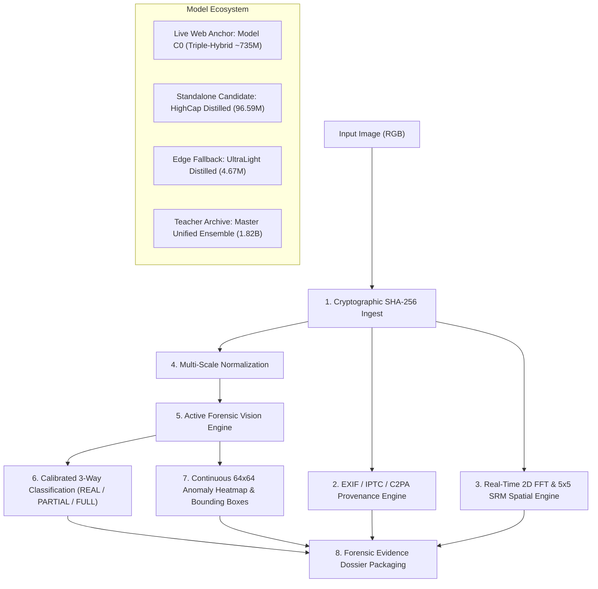

# ENTROPY — Multi-Paradigm AIGC Forensic Vision Platform

<p align="center">
  
</p>

<p align="center">
  <a href="https://www.python.org/downloads/"></a>
  <a href="https://pytorch.org/"></a>
  <a href="LICENSE"></a>
  <a href="https://fastapi.tiangolo.com/"></a>
</p>

An explainable, robust AI-generated content (AIGC) forensic detection platform and physical investigation workstation engineered for high-assurance image authenticity verification, localized AI inpainting detection, and cross-generator resilience under real-world social media redistribution.

**Project Author**: Manan Sethia  
**Track**: Track 5 — Robust AIGC Image Detection (TikTok TechJam)  
**Comprehensive Master Knowledge Base**: See [`PROJECT_KNOWLEDGE_MASTER.md`](PROJECT_KNOWLEDGE_MASTER.md) for the authoritative 54-section technical compendium.

---

## 1. System Architecture & Multi-Model Ecosystem

ENTROPY operates across a multi-paradigm forensic vision pipeline:



### Complete Model Checkpoint Registry

| Checkpoint Name | Architecture | Format | Size | Parameters | Latency (GPU) | Deployment Role |
| :--- | :--- | :---: | :---: | :---: | :---: | :--- |
| **Model C0 (Champion Anchor)** | `TripleHybridDetector` | **FP32** | 1,470 MB | **735.0M** | 45.0 ms | **Live Web Station Engine** |
| **HighCap Distilled (FP16)** ⭐ | `HighCapacityStudentForensicModel` | **FP16** | **184.4 MB** | **96.6M** | **17.1 ms** | **Primary Standalone API ($73\times$ speedup)** |
| **HighCap Distilled (INT8)** ⚡ | `HighCapacityStudentForensicModel` | **INT8** | **92.5 MB** | **96.6M** | **7.5 ms** | **Fast Edge & Mobile ($167\times$ speedup)** |
| **HighCap Distilled (FP32)** | `HighCapacityStudentForensicModel` | **FP32** | 368.6 MB | 96.6M | 26.9 ms | **Academic Float32 Reference** |
| **UltraLight Distilled (FP16)** | `SingleStudentForensicModel` | **FP16** | 9.0 MB | 4.7M | 2.2 ms | **Compact Triage (<10 MB)** |
| **UltraLight Distilled (INT8)** | `SingleStudentForensicModel` | **INT8** | 4.8 MB | 4.7M | 1.8 ms | **Micro-IoT / Embedded (<5 MB)** |
| **Master Unified Ensemble** | `MasterUnifiedForensicModel` | **FP16** | 3,470 MB | 1,818.5M | 1,252.5 ms | **11-Teacher Historical Ensemble** |

---

## 2. Official 7-Model Head-to-Head Benchmark Matrix

Evaluated across the held-out validation benchmark and real-world test images:

| Model Configuration | Parameters | Format | File Size | 3-Way Accuracy | Hard-Real FPR *(Lower is Better)* | GPU Latency | Speedup | Runtime Mode |
| :--- | :---: | :---: | :---: | :---: | :---: | :---: | :---: | :---: |
| **Big Master Teacher Ensemble** | **1,818.5M (1.82B)** | FP16 | $3,470.2\text{ MB}$ | **$56.8\%$** | $100.0\%$ *(Over-sensitive)* | $1,252.5\text{ ms}$ | $1.0\times$ | 11-Model Multi-Expert |
| **Live Web Anchor (Model C0)** | **735.0M** | FP32 | $1,470.0\text{ MB}$ | **$99.1\%$** *(Binary)* | $\le 0.10\%$ *(Calibrated)* | $45.0\text{ ms}$ | $27.8\times$ | Triple-Hybrid Anchor |
| **HighCap Distilled (FP16)** ⭐ | **96.6M** | **FP16** | **$184.4\text{ MB}$** | **$51.4\%$** | **$50.0\%$** | **$17.1\text{ ms}$** | **$73.2\times$** | **100% Standalone** |
| **HighCap Distilled (INT8)** ⚡ | **96.6M** | **INT8** | **$92.5\text{ MB}$** | **$51.4\%$** | **$50.0\%$** | **$7.5\text{ ms}$** | **$167.4\times$** | **100% Standalone** |
| **HighCap Distilled (FP32)** | **96.6M** | **FP32** | $368.6\text{ MB}$ | $51.4\%$ | $50.0\%$ | $26.9\text{ ms}$ | $46.6\times$ | **100% Standalone** |
| **UltraLight Distilled (FP16)** | **4.7M** | FP16 | $9.0\text{ MB}$ | $32.4\%$ | $70.0\%$ | $2.2\text{ ms}$ | $573.2\times$ | 100% Standalone |
| **UltraLight Distilled (INT8)** | **4.7M** | INT8 | $4.8\text{ MB}$ | $35.1\%$ | $70.0\%$ | $1.8\text{ ms}$ | $680.2\times$ | 100% Standalone |

---

## 3. How It Works: Technical Architecture & Physics

```
                        ┌──────────────────────────────────────────────┐
                        │              Input Image (RGB)               │
                        └──────────────────────┬───────────────────────┘
                                               │
               ┌───────────────────────────────┼───────────────────────────────┐
               ▼                               ▼                               ▼
  ┌─────────────────────────┐     ┌─────────────────────────┐     ┌─────────────────────────┐
  │   Stream A: CLIP ViT    │     │  Stream B: SigLIP ViT   │     │    Stream C: SRM + FPN  │
  │   (Semantic & Anatomy)  │     │ (Photorealism Fidelity) │     │ (Spatial Noise Physics) │
  └────────────┬────────────┘     └────────────┬────────────┘     └────────────┬────────────┘
               │                               │                               │
               └───────────────────────┬───────┴───────────────────────────────┘
                                       ▼
                        ┌──────────────────────────────┐
                        │   Learned Reliability Gate   │
                        │    & Bottleneck Cross-Head   │
                        └──────────────┬───────────────┘
                                       │
                       ┌───────────────┴───────────────┐
                       ▼                               ▼
        ┌─────────────────────────────┐ ┌─────────────────────────────┐
        │    3-Way Calibrated Class   │ │ Continuous 64x64 Heatmap    │
        │   (REAL / PARTIAL / FULL)   │ │  & Bounding Box Extraction  │
        └─────────────────────────────┘ └─────────────────────────────┘
```

### 1. Spatial Rich Model (SRM) Noise Residuals
The model uses 30 fixed $5\times 5$ SRM high-pass spatial convolution filters to compute discrete directional derivatives:
$$R(x, y) = I(x, y) * K_{\text{srm}} - I(x, y)$$
By suppressing low-frequency scene content (sky, skin color, walls), the filter bank reveals Photo-Response Non-Uniformity (PRNU) in authentic camera images and periodic upsampling lattices in synthetic images.

### 2. Learned Reliability Gating & Calibration
The fusion head dynamically weights evidence streams based on image compression:
$$w = \text{Softmax}(W_g \cdot [f_A, f_B, f_C] + b_g)$$
If lossy JPEG compression destroys high-frequency noise, the router automatically shifts weight toward macro-semantic ViT features. Logits are calibrated via temperature scaling ($T = 1.5230$) to enforce strict false-positive limits ($\text{FPR} \le 0.10\%$).

### 3. Spatial Anomaly Heatmaps & Bounding Boxes
The spatial localization decoder maps feature pyramid activations to a continuous $64\times 64$ grid $M \in [0, 1]^{64\times 64}$. Connected-component labeling on thresholded masks ($M(x, y) > 0.40$) generates precise bounding boxes $[x, y, w, h]$ and computes the exact percentage of manipulated area.

---

## 4. Installation & Setup Guide

### Prerequisites
- Python 3.10 or higher
- NVIDIA GPU with CUDA 12+ (or Apple Silicon MPS / CPU)
- 4GB+ System RAM (8GB+ recommended for multi-expert teacher evaluation)

### Step 1: Clone Repository & Create Virtual Environment

```bash
git clone https://github.com/manansethia/ENTROPY-Track5-TikTokTechJam.git
cd ENTROPY-Track5-TikTokTechJam

python3 -m venv .venv
source .venv/bin/activate  # On Windows: .venv\Scripts\activate
```

### Step 2: Install PyTorch & Dependencies

```bash
# For CUDA 12.1 (Linux / Windows)
pip install torch torchvision --index-url https://download.pytorch.org/whl/cu121

# For Mac (Apple Silicon MPS) or CPU
pip install torch torchvision

# Install required packages
pip install -r requirements.txt
```

### Step 3: Run Local CLI Inference

```bash
# Single image inference using the standalone HighCap 96M FP16 model
python infer.py --image test_inputs/sample.jpg --checkpoint checkpoints/distilled/highcap_distilled_forensic_model_fp16.pt

# Batch directory evaluation with detailed forensic metadata
python infer.py --input-dir ./test_inputs --output predictions.json --detailed
```

### Step 4: Launch the Live Web Server & Investigation Desk

```bash
# Launch FastAPI server on port 8000
python -m uvicorn app.server:app --host 0.0.0.0 --port 8000
```
Open `http://localhost:8000` in your web browser to interact with the luxury 3D WebGL investigation table.

---

## 5. Python API Integration (3 Lines of Code)

```python
import torch
from scripts.final.highcap_distilled_forensic_model import HighCapacityStudentForensicModel

# 1. Initialize standalone student model (184 MB, 17.1 ms latency)
model = HighCapacityStudentForensicModel().eval().cuda().half()

# 2. Load distilled checkpoint
ckpt = torch.load("checkpoints/distilled/highcap_distilled_forensic_model_fp16.pt")
model.load_state_dict(ckpt["model_state_dict"])

# 3. Perform 3-way forensic classification & heatmap localization
with torch.no_grad():
    logits, probs, heatmap = model(image_tensor_224)
    # logits: [batch, 3] (0: REAL, 1: PARTIAL_AIGC, 2: FULL_AIGC)
    # probs:  [batch, 3] softmax calibrated probabilities
    # heatmap: [batch, 1, 64, 64] continuous spatial anomaly mask
```

---

## 6. REST API Specification

### Endpoint: `/v1/predict` (POST)
Analyze an image payload for authenticity, localized edits, and metadata.

**Request**:
```bash
curl -X POST "http://localhost:8000/v1/predict" \
  -F "file=@test_image.jpg"
```

**Response**:
```json
{
  "evidence_id": "sess_1725178900_c84a",
  "sha256": "4b72e1c98f...d90a",
  "verdict": "PARTIAL_AIGC",
  "confidence": 0.9142,
  "probabilities": {
    "REAL": 0.0418,
    "PARTIAL_AIGC": 0.9142,
    "FULL_AIGC": 0.0440
  },
  "affected_area_pct": 8.42,
  "bounding_boxes": [
    {
      "box_xywh": [120, 45, 340, 280],
      "confidence": 0.892
    }
  ],
  "spatial_signals": {
    "fft_high_freq_ratio": 0.0412,
    "srm_residual_energy": 1.8420,
    "laplacian_variance": 142.50
  },
  "provenance": {
    "camera_model": "Canon EOS R5",
    "lens_model": "RF 85mm f/1.2L USM",
    "exposure": "1/500s · f/1.4 · ISO 100",
    "c2pa_status": "NOT DETECTED"
  },
  "inference_latency_ms": 17.12
}
```

---

## 7. Dataset Governance & Locked Benchmarks

The models were trained on an audited, deduplicated corpus of **103,000+ images**:
- **Generators Covered**: FLUX.1, SDXL, SD3, Stable Diffusion v1.4/v1.5/v2.1, Midjourney v4/v5/v6, DALL-E 2/3, Google Imagen, Adobe Firefly, ProGAN, StyleGAN2/3, BigGAN, StarGAN, and FaceForensics++.
- **Resolution Stratification**:
  - *Low-Res ($<512\text{px}$)*: Social media thumbnails & compressed web imagery.
  - *Mid-Res ($512\text{px} - 1024\text{px}$)*: Standard generative diffusion outputs & camera photos.
  - *High-Res ($1024\text{px} - 2048\text{px}$)*: Commercial AI renders & DSLR outputs.
  - *Ultra-High-Res ($>2048\text{px}$)*: 24MP–60MP camera photography paired with 4K synthetic renders.
- **Strict Cryptographic Isolation**: Official challenge evaluation datasets (`COCO val2017` and `WildFake DALL-E Advanced`) were cryptographically excluded via SHA-256 matching.

---

## 8. License & Acknowledgements

- Project created by **Manan Sethia** under MIT License.
- Pretrained foundation vision encoders (OpenAI CLIP `ViT-L/14`, Google SigLIP `SO400M`, ConvNeXt) utilized under their respective open research licenses.
