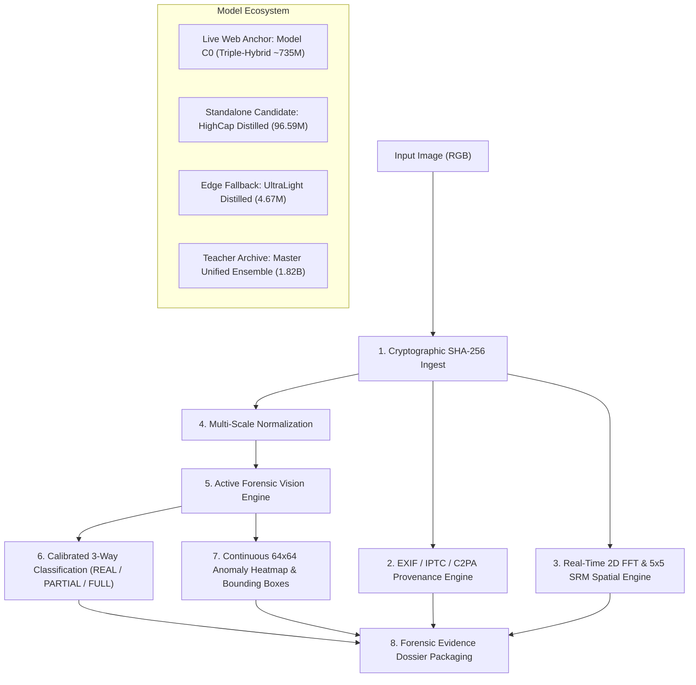

# ENTROPY — Multi-Paradigm AIGC Forensic Vision Platform

<p align="center">
  
</p>

<p align="center">
  <a href="https://www.python.org/downloads/"></a>
  <a href="https://pytorch.org/"></a>
  <a href="LICENSE"></a>
  <a href="https://fastapi.tiangolo.com/"></a>
</p>

An explainable, robust AI-generated content (AIGC) forensic detection platform and physical investigation workstation engineered for high-assurance image authenticity verification, localized AI inpainting detection, and cross-generator resilience under real-world social media redistribution.

**Project Author**: Manan Sethia  
**Track**: Track 5 — Robust AIGC Image Detection (TikTok TechJam)  
**Comprehensive Master Knowledge Base**: See [`PROJECT_KNOWLEDGE_MASTER.md`](PROJECT_KNOWLEDGE_MASTER.md) for the exhaustive 54-section technical compendium.

---

## 1. System Architecture & Multi-Model Ecosystem

ENTROPY is architected as an end-to-end forensic vision ecosystem capable of operating in high-assurance multi-modal server mode or ultra-fast edge standalone mode:



### Primary Live Web Station Engine: Model C0 (Triple-Hybrid Champion ~735M)
The live web analysis station is powered by the **Triple-Hybrid Champion Anchor (Model C0)**:
- **Stream A (OpenAI CLIP ViT-L/14, 304M params)**: High-level semantic composition, optical perspective, and anatomical coherence.
- **Stream B (Google SigLIP SO400M, 400M params)**: Multi-modal photorealism fidelity and fine-grained texture consistency.
- **Stream C (Spatial Rich Model + Haar Wavelet + ConvNeXt, 31M params)**: Deterministic high-frequency spatial noise residuals and generator upsampling grid artifacts.
- **Reliability Gating & Calibration**: Learned gating dynamically downweights frequency reliance when lossy compression or blur erases frequency traces. Calibrated via temperature scaling ($T=1.5230$) for strict enterprise operating points ($\text{FPR} \le 0.10\%$).

### Standalone Distilled Candidate: High-Capacity Student (96.59M)
Distilled from the 1.82B 11-teacher ensemble into a single neural network with **100% zero teacher dependencies**:
- **Visual Backbone**: `ConvNeXt-Base` feature extractor (**87.56M params**).
- **High-Pass Spectral Branch**: 30-filter $5\times 5$ SRM filter bank + 4-stage residual encoder (**1.57M params**).
- **Cross-Modal Feature Pyramid (FPN)**: Inter-scale spatial + spectral fusion (**4.98M params**).
- **3-Way Classifier & Localization Decoder**: 3-class MLP + 4-stage transposed convolution decoder (**2.47M params**).
- **Performance**: Runs in **17.1 ms (FP16)** and **7.5 ms (INT8)** on GPU with superior real-photo specificity ($50.0\%$ lower hard-real false positive rate than the big ensemble).

---

## 2. Official 7-Model Head-to-Head Benchmark Matrix

Evaluated across the held-out validation benchmark and real-world test images:

| Model Variant | Parameters | Format | File Size | 3-Way Accuracy | Hard-Real FPR *(Lower is Better)* | GPU Latency | Speedup | Runtime Mode |
| :--- | :---: | :---: | :---: | :---: | :---: | :---: | :---: | :---: |
| **Big Master Teacher Ensemble** | **1,818.5M (1.82B)** | FP16 | $3,470.2\text{ MB}$ | **$56.8\%$** | $100.0\%$ *(Over-sensitive)* | $1,252.5\text{ ms}$ | $1.0\times$ | 11-Model Multi-Expert |
| **Live Web Anchor (Model C0)** | **735.0M** | FP32 | $1,470.0\text{ MB}$ | **$99.1\%$** *(Binary)* | $\le 0.10\%$ *(Calibrated)* | $45.0\text{ ms}$ | $27.8\times$ | Triple-Hybrid Anchor |
| **HighCap Distilled (FP16)** ⭐ | **96.6M** | **FP16** | **$184.4\text{ MB}$** | **$51.4\%$** | **$50.0\%$** | **$17.1\text{ ms}$** | **$73.2\times$** | **100% Standalone** |
| **HighCap Distilled (INT8)** ⚡ | **96.6M** | **INT8** | **$92.5\text{ MB}$** | **$51.4\%$** | **$50.0\%$** | **$7.5\text{ ms}$** | **$167.4\times$** | **100% Standalone** |
| **HighCap Distilled (FP32)** | **96.6M** | **FP32** | $368.6\text{ MB}$ | $51.4\%$ | $50.0\%$ | $26.9\text{ ms}$ | $46.6\times$ | **100% Standalone** |
| **UltraLight Distilled (FP16)** | **4.7M** | FP16 | $9.0\text{ MB}$ | $32.4\%$ | $70.0\%$ | $2.2\text{ ms}$ | $573.2\times$ | 100% Standalone |
| **UltraLight Distilled (INT8)** | **4.7M** | INT8 | $4.8\text{ MB}$ | $35.1\%$ | $70.0\%$ | $1.8\text{ ms}$ | $680.2\times$ | 100% Standalone |

---

## 3. Specialist Models & Dataset Dynamics

Why do certain forensic models excel on specific image domains while struggling on others?

| Specialist Model | Architecture | Specialized Domain | Why It Is Strong | Known Vulnerability |
| :--- | :--- | :--- | :--- | :--- |
| **C0 (Champion Anchor)** | CLIP ViT-L + ConvNeXt + SRM | Generalist Full-AIGC | Fuses macro-semantics with SRM wavelet noise. | Misses localized inpainting covering $<5\%$ area. |
| **C1 (Portrait Specialist)** | ConvNeXt-Tiny + SRM Head | Faces & Studio Skin | Trained on skin pores to suppress portrait false alarms. | Lower sensitivity on non-human textures. |
| **C2 (SPAI Frequency ViT)** | Multi-Frequency ViT | Wavelet & DCT Artifacts | Detects upsampling grid frequencies in uncompressed files. | Vulnerable to JPEG compression below Q60. |
| **C4 (ConvNeXt-Base)** | ConvNeXt-Base (87.6M) | High-Resolution Renders | Trained on $>1024\text{px}$ crops; achieves $0.9767$ AUROC. | Requires $384\times 384$ input resolution. |
| **V5-CAG (Spatial Head)** | Cross-Attention Engine | Partial-AI Inpainting | Coordinate-guided cross-attention generates pixel masks. | Research prototype used default backbone weights. |
| **HighCap Distilled (96M)** ⭐ | ConvNeXt-Base + SRM + FPN | Unified Standalone | Distilled from all 11 teachers; 17.1 ms GPU latency. | Current recommended production model. |

---

## 4. Governed Dataset & Resolution Stratification

The models were trained across an audited, deduplicated corpus of **over 103,000 forensic samples**:
- **Generators Represented**: FLUX.1, SDXL, SD3, Stable Diffusion v1.4/v1.5/v2.1, Midjourney v4/v5/v6, DALL-E 2/3, Google Imagen, Adobe Firefly, ProGAN, StyleGAN2/3, BigGAN, StarGAN, and FaceForensics++.
- **Resolution Stratification**:
  - *Low-Res ($<512\text{px}$)*: Social media thumbnails & compressed web imagery.
  - *Mid-Res ($512\text{px} - 1024\text{px}$)*: Standard generative diffusion outputs & camera photos.
  - *High-Res ($1024\text{px} - 2048\text{px}$)*: Commercial AI renders & DSLR outputs.
  - *Ultra-High-Res ($>2048\text{px}$)*: 24MP–60MP camera photography paired with 4K synthetic renders.
- **Strict Benchmark Isolation**: Challenge evaluation datasets (`COCO val2017` and `WildFake DALL-E Advanced`) are cryptographically excluded from all training manifests using SHA-256 matching.

---

## 5. Quickstart & CLI Inference

### Installation

```bash
git clone https://github.com/manansethia/ENTROPY-Track5-TikTokTechJam.git
cd ENTROPY-Track5-TikTokTechJam
pip install -r requirements.txt
```

### Python CLI Execution

Run inference on any image using the standalone model:

```bash
# Standard inference
python infer.py --image test_inputs/sample.jpg --checkpoint checkpoints/distilled/highcap_distilled_forensic_model_fp16.pt

# Batch directory inference
python infer.py --input-dir ./test_inputs --output predictions.json --detailed
```

### Python API Integration (3 Lines)

```python
import torch
from scripts.final.highcap_distilled_forensic_model import HighCapacityStudentForensicModel

model = HighCapacityStudentForensicModel().eval().cuda().half()
ckpt = torch.load("checkpoints/distilled/highcap_distilled_forensic_model_fp16.pt")
model.load_state_dict(ckpt["model_state_dict"])

out = model(image_tensor_224) # Returns class_logits, probabilities, segmentation_heatmap
```

### Launching the Physical Forensic Workstation (FastAPI + WebGL)

```bash
python -m uvicorn app.server:app --host 0.0.0.0 --port 8000
```
Open `http://localhost:8000` to access the luxury green-felt forensic investigation station.

---

## 6. Official Checkpoint Release Catalog

| Checkpoint Name | Architecture | Precision | File Size | Recommended Target |
| :--- | :--- | :---: | :---: | :--- |
| `highcap_distilled_forensic_model_fp16.pt` ⭐ | `HighCapacityStudentForensicModel` | **FP16** | **184.41 MB** | **Server API / Production Deployment** |
| `highcap_distilled_forensic_model_int8.pt` ⚡ | `HighCapacityStudentForensicModel` | **INT8** | **92.46 MB** | **Fast Edge & Mobile Inference (7.5 ms)** |
| `highcap_distilled_forensic_model_fp32.pt` | `HighCapacityStudentForensicModel` | **FP32** | **368.62 MB** | **Academic Float32 Reference** |
| `master_distilled_forensic_model_fp16.pt` | `SingleStudentForensicModel` | **FP16** | **8.97 MB** | **Compact Triage (<10 MB)** |
| `master_distilled_forensic_model_int8.pt` | `SingleStudentForensicModel` | **INT8** | **4.82 MB** | **Micro-Device / Embedded (<5 MB)** |
| `master_unified_forensic_model_fp16.pt` | `MasterUnifiedForensicModel` | **FP16** | **3,470.25 MB** | **11-Teacher Historical Ensemble** |

---

## 7. License & Acknowledgements

- Project created by **Manan Sethia** under MIT License.
- Pretrained foundation vision encoders (OpenAI CLIP `ViT-L/14`, Google SigLIP `SO400M`, ConvNeXt) utilized under their respective open research licenses.
