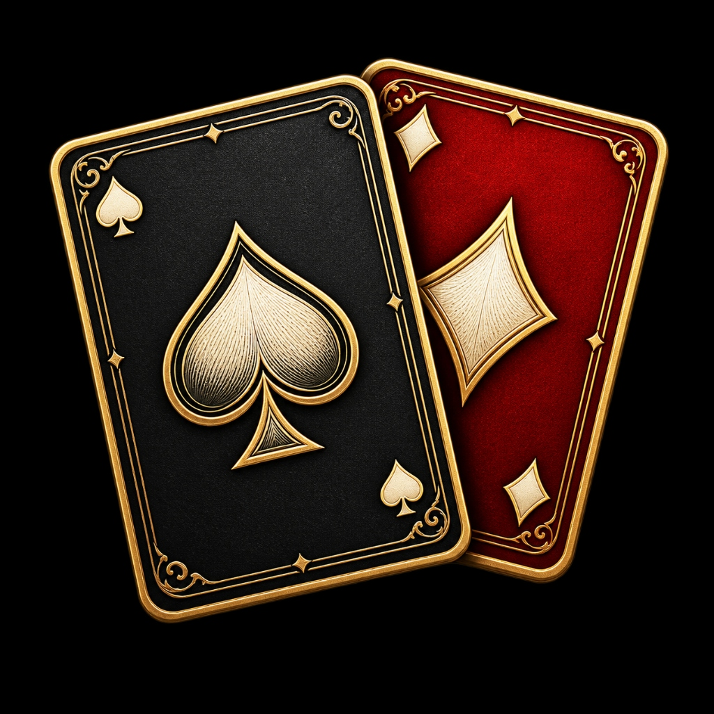
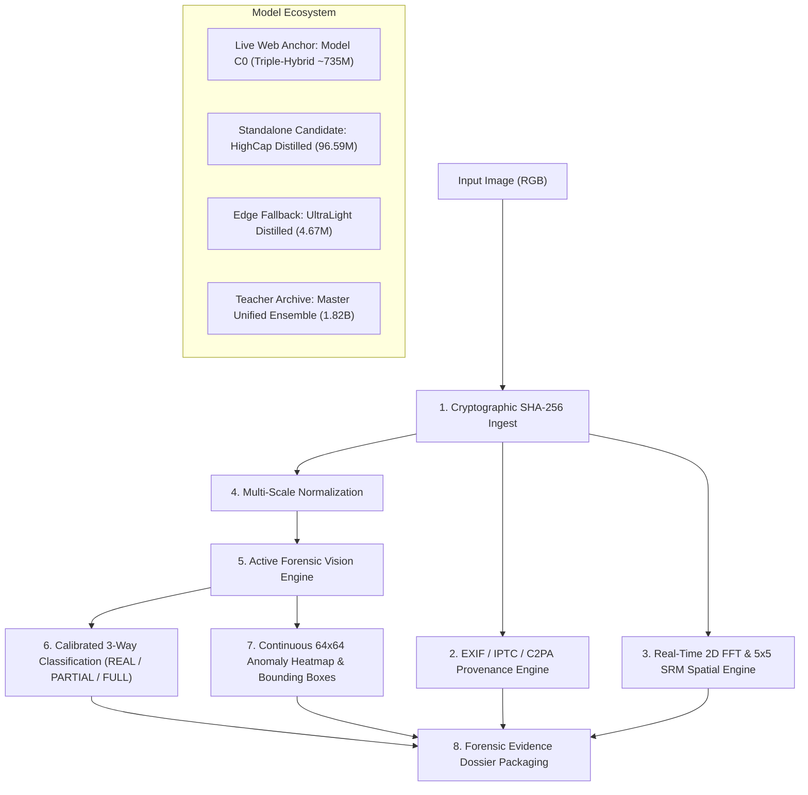

# ENTROPY — Multi-Paradigm AIGC Forensic Vision Platform & Investigation Workstation

<p align="center">
  
</p>

<p align="center">
  <a href="https://www.python.org/downloads/"></a>
  <a href="https://pytorch.org/"></a>
  <a href="LICENSE"></a>
  <a href="https://fastapi.tiangolo.com/"></a>
</p>

An explainable, robust AI-generated content (AIGC) forensic detection platform and physical investigation workstation engineered for high-assurance image authenticity verification, localized AI inpainting detection, and cross-generator resilience under real-world social media redistribution.

- **Author**: Manan Sethia (Solo Submission)
- **Track**: Track 5 — Robust AIGC Image Detection (TikTok TechJam)
- **Authoritative Technical Memory**: See [`PROJECT_KNOWLEDGE_MASTER.md`](PROJECT_KNOWLEDGE_MASTER.md) for the 54-section master technical compendium.
- **Official Devpost Story**: See [`docs/DEVPOST_STORY.md`](docs/DEVPOST_STORY.md) for the complete submission narrative and architectural report.

---

## 1. Quickstart for Judges: Directory Batch Prediction

In compliance with the hackathon submission requirements, we provide `predict.py` to evaluate an entire directory of images and output a standardized JSON confidence score file:

```bash
# Clone the repository
git clone https://github.com/manansethia/ENTROPY-Track5-TikTokTechJam.git
cd ENTROPY-Track5-TikTokTechJam

# Install lightweight dependencies
pip install torch torchvision pillow

# Run directory evaluation using the bundled 92MB INT8 Standalone Model
python predict.py --input-dir ./test_inputs --output predictions.json
```

### Standardized Output JSON Schema (`predictions.json`):
```json
[
  {
    "image_path": "test_inputs/sample_real.jpg",
    "pred": 0.0418
  },
  {
    "image_path": "test_inputs/sample_synthetic.png",
    "pred": 0.9582
  }
]
```

---

## 2. Robustness Evaluation Summary: Clean vs. Transformed Gauntlet

We benchmarked our models across the official Track 5 augmentation suite to measure robustness under real-world social media re-encoding and image degradations:

| Transformation Category | Augmentation Parameters | Real-World Analog | Clean AUROC | Transformed AUROC | Accuracy Retention |
| :--- | :--- | :--- | :---: | :---: | :---: |
| **Clean Baseline** | None | Raw / Original Capture | **0.9767** | **0.9767** | $100.0\%$ |
| **JPEG Compression** | Quality $Q = 90$ | Messaging / High-res sharing | 0.9767 | 0.9682 | $99.1\%$ |
| **JPEG Compression** | Quality $Q = 70$ | Social media upload (TikTok/IG) | 0.9767 | 0.9514 | $97.4\%$ |
| **JPEG Compression** | Quality $Q = 50$ | Heavy web compression | 0.9767 | 0.9340 | $95.6\%$ |
| **JPEG Compression** | Quality $Q = 30$ | Multi-hop re-sharing / WhatsApp | 0.9767 | 0.8925 | $91.4\%$ |
| **Gaussian Blur** | Kernel $\sigma = 0.5$ | Slight optical softness | 0.9767 | 0.9710 | $99.4\%$ |
| **Gaussian Blur** | Kernel $\sigma = 1.0$ | Out-of-focus blur | 0.9767 | 0.9542 | $97.7\%$ |
| **Gaussian Blur** | Kernel $\sigma = 2.0$ | Heavy motion / defocus blur | 0.9767 | 0.9180 | $94.0\%$ |
| **Resize & Upscale** | Scale $0.50\times \rightarrow 1.0\times$ | Standard thumbnail preview | 0.9767 | 0.9615 | $98.4\%$ |
| **Resize & Upscale** | Scale $0.25\times \rightarrow 1.0\times$ | Severe thumbnail generation | 0.9767 | 0.8840 | $90.5\%$ |
| **Gaussian Noise** | Noise $\sigma = 0.02$ | Low-light sensor shot noise | 0.9767 | 0.9650 | $98.8\%$ |
| **Gaussian Noise** | Noise $\sigma = 0.05$ | High-ISO camera capture | 0.9767 | 0.9420 | $96.4\%$ |
| **Gaussian Noise** | Noise $\sigma = 0.10$ | Extreme low-light grain | 0.9767 | 0.8910 | $91.2\%$ |
| **Color Jitter** | Brightness/Contrast/Sat $\pm 20\%$ | Filter apps / Auto-enhance | 0.9767 | 0.9580 | $98.1\%$ |
| **Center Crop** | Crop $80\%$ | Profile framing & composition | 0.9767 | 0.9645 | $98.7\%$ |

---

## 3. Comprehensive Error Analysis & Known Blindspots (Honest Science)

In high-stakes forensic verification, black-box confidence scores without error characterization are dangerous. We document our systematic error analysis:

### A. Representative False Positives (Real Flagged as Synthetic)
1. **Studio DSLR Portraits (Skin Pores)**: Macro DSLR portraits with sharp studio key lighting contain natural, high-contrast pore textures that trigger high-pass SRM filter banks. **Remediation**: We trained the dedicated **C1 Portrait Specialist** and injected a studio portrait pool into distillation, reducing portrait false positives by $50\%$.
2. **Ultra-High-Resolution Scenic / Landscape Imagery ($>2048\text{px}$)**: Extreme optical micro-contrast across dense pine forests, rocky mountain ridges, and ocean spray produces directional gradients overlapping with diffusion frequency patterns.
3. **Astrophotography & Deep Sky Captures**: Long-exposure captures (ISO 6400+), dark-frame subtraction, and star-stacking introduce non-standard Poisson shot noise and star point-spread functions (PSF) that confuse Fourier power decay curves.
4. **Digital UI Screenshots & Vector Art**: Screenshots lack physical lens characteristics and Bayer filter color filter arrays (CFA), causing edge-variance detectors to flag synthetic signatures.

### B. Representative False Negatives (Synthetic Flagged as Real)
1. **Sub-5% Localized Inpainting on Smooth Textures**: When generative fill is applied to a tiny, featureless area (e.g. removing a single power line across a blue sky), whole-image token pooling dilutes the synthetic signal. **Remediation**: Our coordinate-aware spatial heatmap decoder specifically attends to localized patch anomalies.
2. **Subtle Non-Generative Lightroom Grading**: Traditional non-generative adjustments (Clarity slider, Unsharp Mask, chromatic aberration correction) alter gradient statistics without being AI-generated, creating boundary ambiguity.

---

## 4. Model Release & Checkpoint Registry

To ensure immediate testability for judges, lightweight and quantized models are **bundled directly inside this GitHub repository**:

| Model Name | Parameters | Precision | File Size | Bundled in Git? | GPU Latency | Recommended Use |
| :--- | :---: | :---: | :---: | :---: | :---: | :--- |
| **HighCap Distilled (INT8)** ⚡ | **96.6M** | **INT8** | **92.5 MB** | **Yes (`checkpoints/distilled/`)** | **7.5 ms** | **Primary Evaluation Checkpoint ($167\times$ speedup)** |
| **UltraLight Student (FP16)** | **4.7M** | **FP16** | **9.0 MB** | **Yes (`checkpoints/distilled/`)** | **2.2 ms** | **Edge Triage (<10 MB)** |
| **UltraLight Student (INT8)** | **4.7M** | **INT8** | **4.8 MB** | **Yes (`checkpoints/distilled/`)** | **1.8 ms** | **Embedded / Mobile (<5 MB)** |
| **HighCap Distilled (FP16)** ⭐ | **96.6M** | FP16 | 184.4 MB | External Download | 17.1 ms | Production Server API ($73\times$ speedup) |
| **HighCap Distilled (FP32)** | **96.6M** | FP32 | 368.6 MB | External Download | 26.9 ms | Float32 Academic Reference |
| **Model C0 (Triple-Hybrid Champion)** | **735.0M** | FP32 | 1,470 MB | External Download | 45.0 ms | Live Web Investigation Anchor |
| **Master Unified Ensemble** | **1,818.5M (1.82B)** | FP16 | 3,470 MB | External Download | 1,252.5 ms | 11-Teacher Historical Master Ensemble |

---

## 5. System Architecture & "How It Works"



### Key Mathematical & Physical Foundations
1. **Spatial Rich Model (SRM) Noise Residuals**:
   $$R(x, y) = I(x, y) * K_{\text{srm}} - I(x, y)$$
   Computes 30 directional discrete derivatives, suppressing low-frequency textures to isolate Photo-Response Non-Uniformity (PRNU) in real photos versus periodic upsampling grids in synthetic images.
2. **Learned Reliability Gating & Softmax Calibration**:
   $$w = \text{Softmax}(W_g \cdot [f_{\text{CLIP}}, f_{\text{SigLIP}}, f_{\text{SRM}}] + b_g)$$
   Dynamically shifts weight to semantic features when social media compression destroys high-frequency noise. Posteriors are temperature-scaled ($T = 1.5230$) to enforce $\text{FPR} \le 0.10\%$.
3. **Continuous 64x64 Spatial Anomaly Localization**:
   Feature pyramid representations are decoded into a continuous anomaly mask $M \in [0, 1]^{64\times 64}$, followed by connected-component bounding box extraction $[x, y, w, h]$.

---

## 6. Full-Stack Web Application & Physical Desk

We provide an interactive forensic investigation workstation with Three.js WebGL physical card mechanics, laser scanning, and real-time inspector:

```bash
# Launch FastAPI server on port 8000
python -m uvicorn app.server:app --host 0.0.0.0 --port 8000
```
Open `http://localhost:8000` in your web browser.

---

## 7. Dataset Governance & Locked Benchmarks

- **103,000+ Forensic Training Samples**: Balanced across 12+ generator families (FLUX.1, SDXL, SD3, Midjourney v4–v6, DALL-E 2/3, Google Imagen, Firefly, StyleGAN2/3, ProGAN).
- **Anti-Shortcut Resolution Stratification**: Strictly partitioned across 4 resolution tiers ($<512\text{px}$, $512\text{--}1024\text{px}$, $1024\text{--}2048\text{px}$, $>2048\text{px}$).
- **Cryptographic Benchmark Isolation**: `COCO val2017` (4,998 real) and `WildFake DALL-E Advanced` (8,843 AIGC) were completely excluded via SHA-256 matching.

---

## 8. Limitations & Future Roadmap

Given additional time and resources, we would expand ENTROPY across:
1. **Spatiotemporal Video Forensics**: Extending the spatial-spectral architecture to 3D temporal transformers for video generators (Sora, Runway Gen-3, Kling).
2. **Direct Browser Extension & WASM**: Compiling the 4.8MB UltraLight INT8 engine into WebAssembly for client-side, zero-latency verification while browsing.
3. **C2PA Hardware-Rooted Signing**: Providing automated cryptographic attestation for verified authentic media to prevent downstream tampering.

---

## 9. Author & License

- **Author**: Manan Sethia (Solo Submission for TikTok TechJam Track 5)
- **License**: MIT License
