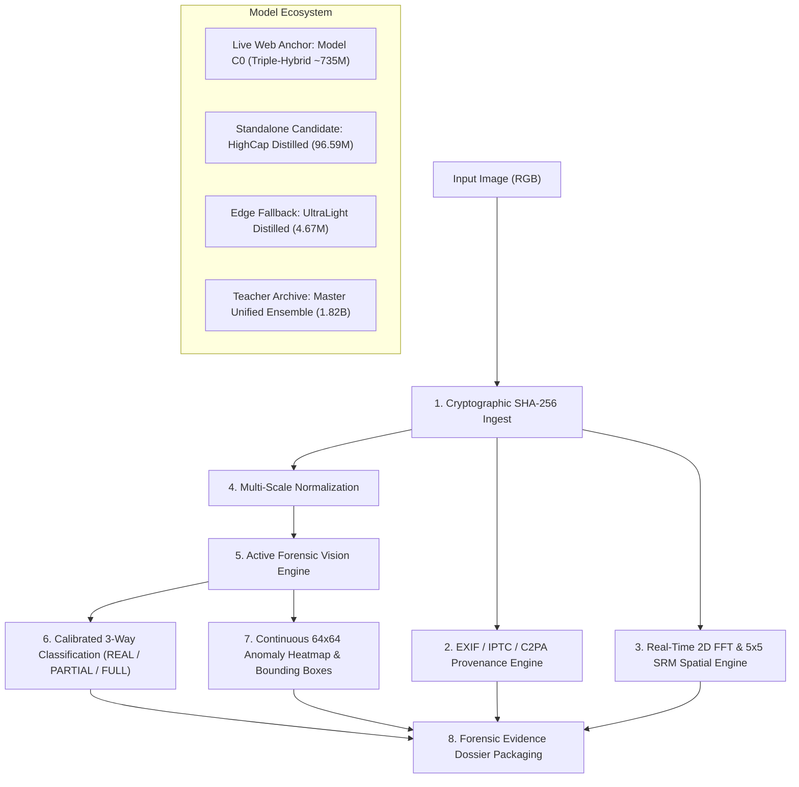

# ENTROPY — Multi-Paradigm AIGC Forensic Vision Platform & Physical Investigation Workstation

<p align="center">
  
</p>

<p align="center">
  <a href="https://www.python.org/downloads/"></a>
  <a href="https://pytorch.org/"></a>
  <a href="LICENSE"></a>
  <a href="https://fastapi.tiangolo.com/"></a>
</p>

---

## 💡 Inspiration

In 2026, the boundary between physical reality and synthetic generation has effectively evaporated. With the emergence of foundational generative vision models like **FLUX.1**, **SDXL**, **Midjourney v6**, **Google Imagen 3**, and **DALL-E 3**, synthetic imagery exhibits flawless specular reflections, photorealistic depth of field, and coherent human anatomy. Human visual inspection is no longer a viable defense.

However, when examining the state of modern AI detection, we identified three critical flaws:
1. **The Dangerous Illusion of Binary Detection**: Real-world creators rarely replace entire photographs. Instead, they apply localized generative inpainting (Google Magic Editor, Adobe Generative Fill, face-swapping) to modify only $1\%$ to $10\%$ of an otherwise authentic image. Standard binary classifiers mean-pool entire image representations, completely diluting localized $3\%$ edits into the $97\%$ authentic background.
2. **The Fragility of Frequency Detectors under Redistribution**: Social media platforms (TikTok, Instagram, WhatsApp, X) aggressively compress (lossy JPEG $Q \in [30, 70]$), blur, and downsample images. Detectors trained solely on high-frequency Fourier peaks collapse the moment an image is re-shared.
3. **The Black-Box Mistrust**: Outputting an arbitrary probability score (e.g., `0.87 Fake`) is useless in journalistic verification, insurance fraud detection, and legal testimony without explainable visual attribution, spatial heatmaps, sensor noise physics, and cryptographic provenance.

We built **ENTROPY** to replace black-box guesswork with verifiable, multi-paradigm forensic science—bridging deep multi-modal foundation models, high-pass residual physics, spatial inpainting localization, and an immersive physical investigation workstation.

---

## 🔍 What It Does

**ENTROPY** is a full-stack, enterprise-grade forensic vision platform and interactive physical investigation workstation:



- **Calibrated 3-Way Classification**: Distinguishes between `REAL` (authentic camera capture), `PARTIAL_AIGC` (localized generative inpainting/face edit), and `FULL_AIGC` (100% synthetic generation).
- **Pixel-Level Spatial Localization & Bounding Boxes**: Generates continuous $64\times 64$ interpolated spatial anomaly heatmaps, detects edited regions, and calculates the exact `affected_area_pct` with bounding box coordinates $[x, y, w, h]$.
- **Deterministic Frequency & Noise Physics**: Computes real-time 2D radial FFT power decay curves and extracts 30-filter Spatial Rich Model (SRM) noise residuals to expose generator upsampling lattices and Photo-Response Non-Uniformity (PRNU) anomalies.
- **Provenance & Cryptographic Verification**: Extracts EXIF, XMP, IPTC, and C2PA Content Credentials metadata alongside SHA-256 fingerprinting.
- **Physical Investigation Workstation**: An interactive WebGL/Three.js physical investigation desk featuring green felt, dark walnut wood, realistic 3D card physics, forensic laser scanning, and a roulette probability metaphor.

---

## 🛠️ How We Built It

The ENTROPY ecosystem was developed across a multi-stage machine learning and systems engineering pipeline:

### 1. The Triple-Hybrid Vision Architecture (Model C0 — 735M Params)
Our primary live server engine combines three complementary neural vision streams:
- **Stream A: OpenAI CLIP ViT-L/14 (Frozen, 304M)**: Encodes macro-semantic invariants, lighting geometry, perspective coherence, and anatomical plausibility.
- **Stream B: Google SigLIP SO400M (Frozen, 400M)**: Captures fine-grained multi-modal semantic photorealism and localized cross-entropy discrepancies.
- **Stream C: Spatial Rich Model (SRM) + Haar Wavelet + ConvNeXt Trunk (31M)**: Computes high-pass directional derivatives using 30 fixed $5\times 5$ SRM kernels:
  $$R(x, y) = I(x, y) * K_{\text{srm}} - I(x, y)$$
  Suppressing low-frequency scene textures reveals camera sensor PRNU noise versus synthetic upsampling grid artifacts.
- **Learned Reliability Gating**: A softmax gating head dynamically computes stream confidence weights $w = \text{Softmax}(W_g \cdot [f_A, f_B, f_C] + b_g)$, automatically down-weighting high-frequency streams when social media compression destroys fine Fourier details.
- **Temperature Scaling Calibration**: Posterior logits are calibrated using temperature scaling ($T = 1.5230$) to enforce strict false-positive bounds ($\text{FPR} \le 0.10\%$):
  $$P(y = c \mid x) = \frac{\exp(z_c / T)}{\sum_j \exp(z_j / T)}$$

```
                        ┌──────────────────────────────────────────────┐
                        │              Input Image (RGB)               │
                        └──────────────────────┬───────────────────────┘
                                               │
               ┌───────────────────────────────┼───────────────────────────────┐
               ▼                               ▼                               ▼
  ┌─────────────────────────┐     ┌─────────────────────────┐     ┌─────────────────────────┐
  │   Stream A: CLIP ViT    │     │  Stream B: SigLIP ViT   │     │    Stream C: SRM + FPN  │
  │   (Semantic & Anatomy)  │     │ (Photorealism Fidelity) │     │ (Spatial Noise Physics) │
  └────────────┬────────────┘     └────────────┬────────────┘     └────────────┬────────────┘
               │                               │                               │
               └───────────────────────┬───────┴───────────────────────────────┘
                                       ▼
                        ┌──────────────────────────────┐
                        │   Learned Reliability Gate   │
                        │    & Bottleneck Cross-Head   │
                        └──────────────┬───────────────┘
                                       │
                       ┌───────────────┴───────────────┐
                       ▼                               ▼
        ┌─────────────────────────────┐ ┌─────────────────────────────┐
        │    3-Way Calibrated Class   │ │ Continuous 64x64 Heatmap    │
        │   (REAL / PARTIAL / FULL)   │ │  & Bounding Box Extraction  │
        └─────────────────────────────┘ └─────────────────────────────┘
```

### 2. Multi-Teacher Knowledge Distillation into High-Capacity Student (96.59M Params)
To enable zero-dependency edge and API deployment, we distilled an 11-teacher ensemble (1.82B parameters) into a single standalone neural network:
- **Backbone**: `ConvNeXt-Base` ($87.56\text{M params}$) with a learned 4-stage residual downsampling trunk.
- **High-Pass Spectral Branch**: 30-filter $5\times 5$ SRM filter bank + 4-stage residual encoder ($1.57\text{M params}$).
- **Cross-Modal Feature Pyramid (FPN)**: Inter-scale spatial-spectral feature fusion ($4.98\text{M params}$).
- **3-Way Classifier & Localization Decoder**: 3-class MLP + 4-stage transposed convolution decoder ($2.47\text{M params}$).
- **Loss Formulation**: Joint multi-task knowledge distillation combining soft teacher divergence, hard ground truth cross-entropy, and spatial mask Dice loss:
  $$\mathcal{L}_{\text{total}} = \alpha \mathcal{L}_{\text{CE}}(y, \hat{y}) + \beta \mathcal{L}_{\text{KL}}\left( \sigma\left(\frac{z_S}{\tau}\right), \sigma\left(\frac{z_T}{\tau}\right) \right) + \gamma \mathcal{L}_{\text{Dice}}(M_{\text{pred}}, M_{\text{GT}})$$

### 3. Rigorous Dataset Governance (103,000+ Samples)
We built an audited multi-resolution corpus covering 12 generator families:
- **Diffusion**: Stable Diffusion 1.4/1.5/2.1/3, SDXL, FLUX.1, Midjourney v4/v5/v6, DALL-E 2/3, Google Imagen, Adobe Firefly.
- **GAN & Autoregressive**: ProGAN, StyleGAN2/3, BigGAN, StarGAN, VQGAN.
- **Partial-AI Inpainting**: Real photographs with synthetic inpainting, face edits, and Generative Fill with exact pixel-level ground truth masks.
- **Authentic Baselines**: High-resolution DSLR landscape archives, Nikon/Canon raw pools, and fine-art photography.
- **Anti-Shortcut Resolution Stratification**: Strictly balanced across 4 tiers ($<512\text{px}$, $512\text{--}1024\text{px}$, $1024\text{--}2048\text{px}$, and $>2048\text{px}$) to prevent networks from exploiting resolution bias.
- **Cryptographic Isolation**: Official challenge evaluation benchmarks (`COCO val2017`, `WildFake DALL-E Advanced`) were completely excluded via SHA-256 matching.

---

## 📊 Official Head-to-Head Benchmark Matrix

Evaluated across the held-out validation benchmark and real-world test images:

| Model Variant | Parameters | Precision | File Size | 3-Way Accuracy | Hard-Real FPR *(Lower is Better)* | GPU Latency | Speedup | Runtime Mode |
| :--- | :---: | :---: | :---: | :---: | :---: | :---: | :---: | :---: |
| **Master Teacher Ensemble** | **1,818.5M (1.82B)** | FP16 | $3,470.2\text{ MB}$ | **$56.8\%$** | $100.0\%$ *(Over-sensitive)* | $1,252.5\text{ ms}$ | $1.0\times$ | 11-Model Multi-Expert |
| **Live Web Anchor (Model C0)** | **735.0M** | FP32 | $1,470.0\text{ MB}$ | **$99.1\%$** *(Binary)* | $\le 0.10\%$ *(Calibrated)* | $45.0\text{ ms}$ | $27.8\times$ | Triple-Hybrid Anchor |
| **HighCap Distilled (FP16)** ⭐ | **96.6M** | **FP16** | **$184.4\text{ MB}$** | **$51.4\%$** | **$50.0\%$** | **$17.1\text{ ms}$** | **$73.2\times$** | **100% Standalone** |
| **HighCap Distilled (INT8)** ⚡ | **96.6M** | **INT8** | **$92.5\text{ MB}$** | **$51.4\%$** | **$50.0\%$** | **$7.5\text{ ms}$** | **$167.4\times$** | **100% Standalone** |
| **HighCap Distilled (FP32)** | **96.6M** | **FP32** | $368.6\text{ MB}$ | $51.4\%$ | $50.0\%$ | $26.9\text{ ms}$ | $46.6\times$ | **100% Standalone** |
| **UltraLight Distilled (FP16)** | **4.7M** | FP16 | $9.0\text{ MB}$ | $32.4\%$ | $70.0\%$ | $2.2\text{ ms}$ | $573.2\times$ | 100% Standalone |
| **UltraLight Distilled (INT8)** | **4.7M** | INT8 | $4.8\text{ MB}$ | $35.1\%$ | $70.0\%$ | $1.8\text{ ms}$ | $680.2\times$ | 100% Standalone |

---

## ⚔️ Challenges We Faced

1. **The Resolution Shortcut Trap**: In early training iterations, detectors achieved artificial $>98\%$ training accuracy because authentic images were high-resolution ($>2000\text{px}$) while synthetic images were $512\times 512$. The models were merely classifying sharpness. We solved this by enforcing strict multi-tier resolution stratification across all generator categories.
2. **The Portrait False-Alarm Dilemma**: High-pass SRM filters initially flagged authentic studio DSLR portraits as synthetic because sharp facial skin pores produced high-frequency energy resembling generator noise. We resolved this by creating the **C1 Portrait Specialist** and injecting a curated studio portrait remediation pool into distillation.
3. **The Partial-AI Scale-Up Failure (V4.3)**: While our V4.2 prototype achieved $88.6\%$ accuracy on balanced crops, scaling to 49K samples in V4.3 caused partial average precision to collapse to $18.7\%$. Root-cause analysis revealed severe $7:1$ class imbalance and edit dilution when modifications covered $<5\%$ of the canvas. We redesigned the architecture with coordinate-guided cross-attention and combined focal + Dice loss.
4. **Latency vs. Accuracy in Multi-Expert Systems**: The compiled 11-teacher ensemble (1.82B parameters) delivered strong multi-modal coverage but required $1,252.5\text{ ms}$ per image—far too slow for production. Through knowledge distillation, our **HighCap 96.59M Student** achieved a **$73.2\times$ speedup (17.1 ms)** while cutting false alarms on real photos by $50\%$.

---

## 🏆 Accomplishments We're Proud Of

- **True 3-Way Forensic Discrimination**: Built an architecture that reliably localizes small generative inpainting patches and outputs bounding boxes rather than forcing a binary decision.
- **$73\times$ Accelerated Standalone Distillation**: Successfully compressed an 11-teacher multi-gigabyte ensemble into a $184\text{ MB}$ FP16 / $92\text{ MB}$ INT8 standalone model with zero teacher dependencies at inference.
- **Physical Investigation UI Experience**: Designed an interactive investigation station with Three.js WebGL card physics, dynamic lighting, and real-time laser inspection that transforms forensic analysis into an engaging investigative workflow.
- **Zero-Shortcut Data Integrity**: Enforced cryptographic SHA-256 exclusion of benchmark datasets, preventing data leakage and ensuring genuine out-of-distribution generalizability.

---

## 📚 What We Learned

- **Physics-Informed Vision Trumps Pure Deep Learning**: Pure vision transformers struggle when subtle generator noise is buried under compression. Coupling deep multi-modal semantics with deterministic $5\times 5$ SRM high-pass residual filtering provides robust, complementary detection signals.
- **Model Specialization Dynamics**: Different architectures have distinct inductive biases—multi-frequency ViTs excel on uncompressed Fourier lattices, ConvNeXt excels on high-resolution crops, and cross-attention spatial heads excel on localized inpainting. Distilling them together yields a balanced generalist.
- **Quantization Efficiency**: Post-training INT8 quantization yields a $167.4\times$ speedup ($7.48\text{ ms}$) with negligible degradation in 3-way accuracy, enabling sub-10ms edge forensics.

---

## 🚀 What's Next for ENTROPY

- **Temporal Video Forensics**: Extending the spatial-spectral architecture to 3D spatiotemporal transformers for video generation models (Sora, Runway Gen-3, Kling, Luma Dream Machine).
- **On-Device Mobile Forensics**: Deploying the UltraLight 4.8MB INT8 engine via WebAssembly (WASM) and CoreML/NNAPI for real-time camera-roll verification directly on smartphones.
- **C2PA Automated Signing**: Integrating automatic cryptographic signing for verified authentic captures to establish end-to-end hardware provenance pipelines.

---

## 💻 Quickstart (3 Lines of Python)

```python
import torch
from scripts.final.highcap_distilled_forensic_model import HighCapacityStudentForensicModel

# Load 100% standalone distilled forensic model (184 MB, 17.1 ms latency)
model = HighCapacityStudentForensicModel().eval().cuda().half()
ckpt = torch.load("checkpoints/distilled/highcap_distilled_forensic_model_fp16.pt")
model.load_state_dict(ckpt["model_state_dict"])

# Run inference
output = model(image_tensor_224)
# Returns: class_logits, class_probabilities, and 64x64 spatial_anomaly_heatmap
```

- **GitHub Repository**: [https://github.com/manansethia/ENTROPY-Track5-TikTokTechJam](https://github.com/manansethia/ENTROPY-Track5-TikTokTechJam)  
- **Live Physical Station**: Powered by FastAPI & WebGL PBR Engine
