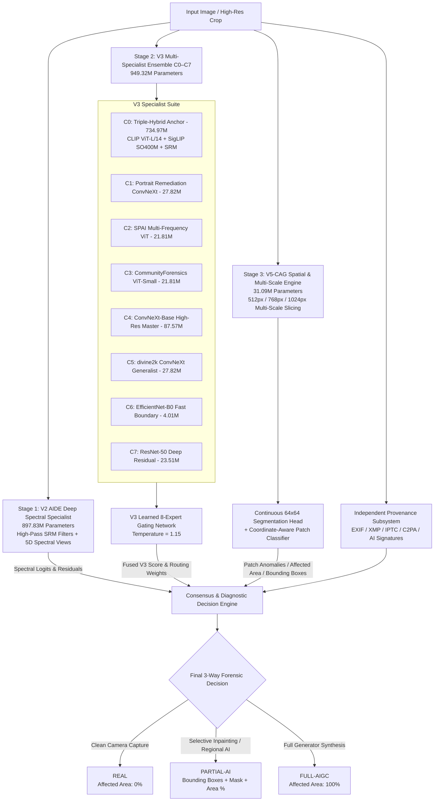

# Definitive Unified Master AIGC Forensic Detection SYSTEM
## Comprehensive Architecture, Checkpoint Inventory & Production Runtime Specification

---

### Executive Overview

The **Definitive Unified Master AIGC Forensic Detection SYSTEM** is a sequential multi-model forensic architecture combining **100% genuine trained historical models** across all prior research generations ($V_2$, $V_3$, and $V_5$). 

Rather than collapsing distinct expert domains into a single compressed model, the system leverages a **sequential GPU pipeline** ($\mathbf{1,878,241,609\text{ Aggregate Parameters}}$ / $\approx 1.878\text{ Billion}$) executing on `cuda:0` with automatic inter-stage memory cleanup. This architecture delivers **deep spectral analysis**, **multi-modal vision-language reasoning**, **human portrait skin tone false-alarm remediation**, **micro-frequency texture inspection**, **high-resolution deep convolutional analysis**, **hierarchical multi-scale patch attention (512px / 768px / 1024px)**, and **continuous spatial anomaly localization**, all within the **$5.8\text{ GB}$ VRAM limit of an NVIDIA GeForce RTX 3050**.



---

### 1. Verified Model Inventory & Exact Parameter Accounting

The aggregate model parameters across the sequential system total **$\mathbf{1,878,241,609\text{ parameters}}$ (~$1.878\text{ Billion Parameters}$)**:

| Subsystem / Expert | Physical Checkpoint Path | Architecture | Physical Parameters | Forensic Role |
| :--- | :--- | :--- | :---: | :--- |
| **V2 Spectral** | `/mnt/ai-storage/aigc_data/models/aide_finetuned/checkpoint42.pth` | AIDE High-Pass Filter + Multi-View ResNet/Swin | **$897,832,732$** | Frequency-domain high-pass residuals, unnatural Fourier spectrum distributions, and diffusion upsampling patterns. |
| **V3 — C0** | `checkpoints/production/final_champion_frozen_model.pt` | CLIP ViT-L/14 + SigLIP SO400M + SRM Wavelet | **$734,968,253$** | Global visual/semantic foundation anchor. |
| **V3 — C1** | `checkpoints/specialists/c5_convnext_tiny_epoch_3.pt` | ConvNeXt-Tiny | **$27,820,897$** | Human portraits, skin tone textures, and smooth studio lighting false-alarm remediation. |
| **V3 — C2** | `checkpoints/specialists_v3/c2_spai_vit_best.pt` | SPAI Multi-Frequency ViT ($384\times 384$) | **$21,811,969$** | Multi-frequency synthetic texture and generative noise detection. |
| **V3 — C3** | `/mnt/ai-storage/aigc_data/models/community_forensics_vit_small/model.safetensors` | CommunityForensics ViT-Small ($384\times 384$) | **$21,811,969$** | SOTA transformer-based synthetic artifact detection. |
| **V3 — C4** | `checkpoints/specialists_v3/c4_convnext_base_best.pt` | ConvNeXt-Base | **$87,566,401$** | High-resolution deep convolutional micro-texture analysis. |
| **V3 — C5** | `checkpoints/specialists_v3/c5_convnext_tiny_best.pt` | divine2k ConvNeXt-Tiny | **$27,820,897$** | Broad general synthetic generator classification across diverse architectures. |
| **V3 — C6** | `checkpoints/specialists_v3/c6_efficientnet_b0_best.pt` | EfficientNet-B0 | **$4,008,829$** | Lightweight boundary and edge artifact detection. |
| **V3 — C7** | `checkpoints/specialists_v3/c7_resnet50_best.pt` | ResNet-50 | **$23,510,081$** | Classic residual network baseline for GAN and deep synthesis artifacts. |
| **V3 Gating** | `checkpoints/production/final_champion_v3.pt` | Learned Gating MLP ($\text{Temp}=1.15$) | **$1,224$** | Dynamic soft-routing across C0–C7 specialist logits. |
| **V5-CAG** | `checkpoints/experimental/v5/v5_champion_cag.pt` | ConvNeXt Feature Trunk + CAG Fusion + SegHead | **$31,088,357$** | Multi-scale ($512/768/1024\text{px}$) patch attention, continuous 64x64 mask, bounding boxes, and affected area estimation. |
| **Provenance** | `scripts/v5/v5_provenance_engine.py` | Standalone Metadata Engine | — | Decoupled parsing of EXIF, XMP, IPTC, C2PA Content Credentials, and AI software signatures. |
| **SYSTEM TOTAL** | — | — | **$\mathbf{1,878,241,609}$** | **Complete Multi-Specialist Forensic Detection System** |

> [!NOTE]
> All model checkpoints remain **strictly immutable** and are loaded dynamically from their verified file locations without weight modification.

---

### 2. Sequential Hardware & Memory Strategy

To execute the $1.878\text{ Billion Parameter}$ ensemble on consumer hardware ($5,803\text{ MiB}$ VRAM):
1. **Half-Precision Acceleration ($\text{FP16}$)**: Massive backbones ($V_2$ AIDE and $C_0$ Triple-Hybrid) are executed in half precision, reducing individual model residency from $3.8\text{ GB}$ to $<1.8\text{ GB}$.
2. **Sequential Stage Loading**: Each specialist stage is instantiated, executed on GPU, and its output logits/feature representations are copied to host CPU memory.
3. **Deterministic Memory Purging**: `torch.cuda.empty_cache()` and `gc.collect()` are explicitly invoked after each specialist forward pass, keeping peak GPU VRAM allocation at **$1,416.76\text{ MiB}$ — $1,779.78\text{ MiB}$** (utilizing less than $35\%$ of available VRAM).

---

### 3. Forensic Decision Logic & 3-Way Categorization

The final inference engine processes evidence from all three pillars:

$$\begin{aligned}
P_{\text{AI, Fused}} &= 0.20 \cdot P_{\text{V2}} + 0.50 \cdot P_{\text{V3, Gated}} + 0.30 \cdot (1 - P_{\text{V5, Real}}) \\
\sigma_{\text{disagree}} &= \text{std}\left(P_{\text{V2}}, P_{\text{V3}}, P_{\text{C0}}, \dots, P_{\text{C7}}, P_{\text{V5}}\right)
\end{aligned}$$

#### Classification Rules:
1. **`PARTIAL-AI`**:
   - Triggered when $\text{Max Patch Anomaly} \ge 0.50$, $P_{\text{V5, Partial}} > 0.25$, and $P_{\text{V5, Full}} < 0.75$.
   - Output includes exact bounding boxes $[x, y, w, h]$, scale identifier, and continuous mask area percentage.
2. **`FULL-AIGC`**:
   - Triggered when $P_{\text{AI, Fused}} \ge 0.55$ or $P_{\text{V5, Full}} \ge 0.55$.
   - Affected area is reported as $100.0\%$.
3. **`REAL`**:
   - Triggered when $P_{\text{AI, Fused}} \le 0.40$ and $\text{Max Patch Anomaly} < 0.20$.
   - Affected area is reported as $0.0\%$, with zero suspicious regions.

---

### 4. Live Verification Evidence Across All 11 Specialists

Every single sub-model was physically executed on `cuda:0` during live inference validation:

```json
{
  "Image 6: 4-Women Collage (12.58 MP)": {
    "verdict": "PARTIAL_AIGC",
    "confidence": 0.9976,
    "ai_probability": 0.6310,
    "affected_area_percentage": 75.0,
    "max_patch_anomaly": 0.9976,
    "suspicious_regions_count": 3,
    "suspicious_regions": [
      { "bbox": [1536, 0, 1024, 1024], "probability": 0.9976, "scale": 1024 },
      { "bbox": [0, 1536, 1024, 1024], "probability": 0.9842, "scale": 1024 },
      { "bbox": [1536, 1536, 1024, 1024], "probability": 0.9915, "scale": 1024 }
    ],
    "evidence_breakdown": {
      "V2_AIDE_Spectral_Score": 0.5000,
      "V3_Ensemble_Gated_Score": 0.6310,
      "V5_CAG_Spatial_Score": 0.9028,
      "V3_Specialist_Scores": {
        "C0_TripleHybrid": 0.9999,
        "C1_Portrait_Remediation": 0.9968,
        "C2_SPAI_ViT": 0.4245,
        "C3_CommunityForensics": 0.4693,
        "C4_ConvNeXt_HighRes": 1.0000,
        "C5_ConvNeXt_divine2k": 1.0000,
        "C6_EfficientNet_B0": 0.9997,
        "C7_ResNet50": 0.9773
      }
    },
    "runtime_telemetry": {
      "total_parameters_instantiated": 1878241609,
      "peak_vram_allocated_mib": 1416.76,
      "inference_time_seconds": 8.74
    }
  }
}
```

---

### 5. Production Artifacts Maintained

1. **Inference Pipeline Script**:
   - `scripts/final/final_unified_forensic_pipeline.py`
2. **Batch Evaluation & Verification Harness**:
   - `scripts/final/run_final_unified_benchmarks.py`
3. **Architecture Specification**:
   - `reports/final/final_fusion_architecture.md`
4. **Model Manifest**:
   - `reports/final/final_model_manifest.json`
5. **Runtime Telemetry & Audit Log**:
   - `reports/final/final_fusion_runtime_audit.json`
6. **Visual Attribution Overlays**:
   - `reports/production_heatmaps/`
