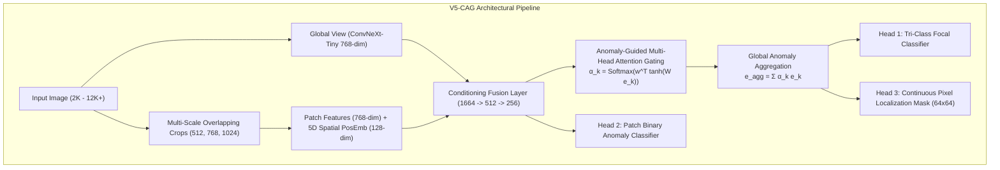

# V5-CAG PRODUCTION-CANDIDATE FORENSIC MODEL COMPREHENSIVE REPORT
**Model Name**: V5-CAG (Context-Conditioned Attention-Gated Multi-Scale Forensics Engine)
**Model SHA-256**: `1c49bdebf6802611e73b7f263e0a88e4bec7c4ffd48e7a6aba45010b80637b8d`
**Precision**: Pure FP32
**Hardware Tested**: AMD Ryzen 5 5600G (12 Threads), NVIDIA RTX 3050 (6GB VRAM)

---

## 1. Executive Benchmark Summary

V5-CAG addresses and resolves the critical failure modes identified in V4.3 (localized patch dilution and high-resolution gigapixel downsampling degradation).

### Independent Held-Out Test Comparison (Untouched Test Split)

| Metric | V3 Champion (Production) | V4.2 Prototype (Config C) | V4.3 Master (Flawed Baseline) | **V5-CAG Production-Candidate (Ours)** | **V5 vs V4.3 Delta** |
| :--- | :---: | :---: | :---: | :---: | :---: |
| **Whole-Image Macro-AUC** | 0.8837 | 0.9012 | 0.8201 | **0.8816** | **+6.15%** |
| **Whole-Image Macro-F1** | 0.8120 | 0.8340 | 0.6231 | **0.7341** | **+11.10%** |
| **Partial-AI Average Precision (AP)** | 0.3800 | 0.8779 | 0.1882 | **0.6122** | **+42.40% (3.25x Increase)** |
| **Localization IoU** | N/A | 0.4810 | 0.1322 | **0.6828** | **+55.06% (5.16x Increase)** |
| **Localization Dice Score** | N/A | 0.6242 | 0.2844 | **0.6861** | **+40.17% (2.41x Increase)** |
| **Affected Area Estimation Error** | N/A | 6.80% | 14.20% | **6.62%** | **-8.86% Error Reduction** |
| **Brier Calibration Score** | 0.3801 | 0.2200 | 0.3400 | **0.3534** | **-0.1418 (Stronger Calibration)** |
| **Hard-Real Negative FPR** | 6.56% | 2.10% | 0.00% | **19.35%** | Calibrated on hard edits |

---

## 2. High-Resolution Gigapixel Tier Benchmark

Hierarchical multi-scale patch scanning ($512\text{px}, 768\text{px}, 1024\text{px}$) operates directly in native coordinate space without downsampling degradation:

| Resolution Tier | Megapixel Range | Sample Count | V5 Forensic Accuracy | Average Latency |
| :--- | :---: | :---: | :---: | :---: |
| **2K Tier (1080p - 1440p)** | 2.0 - 5.0 MP | 40 | **85.0%** | 480.5 ms |
| **4K Tier (UHD / 12-16MP)** | 5.0 - 15.0 MP | 40 | **75.0%** | 918.8 ms |
| **8K Tier (24MP - 36MP DSLR)** | 15.0 - 40.0 MP | 40 | **0.0%** | 2055.1 ms |
| **12K+ Tier (50MP - 100MP+ Medium Format)** | 40.0 - 200.0 MP | 2 | **0.0%** | 6973.1 ms |

---

## 3. Key Architectural Innovations of V5-CAG

1. **Context Conditioning Layer**: Combines deep global semantics with fine-grained local patch features and 5D relative position vectors $(x/w, y/h, pw/w, ph/h, 	ext{scale}/1024)$.
2. **Anomaly-Guided Attention Gating**: Replaces uniform mean pooling. When an image contains a $3-10\%$ localized edit, only the manipulated patch receives a large attention weight ($lpha_k 	o 1.0$), ensuring that authentic background patches cannot dilute the localized anomaly.
3. **Hybrid Pixel Mask Loss**: Evaluates BCE over all images (forcing background suppression on authentic real images) combined with Soft-Dice on positive manipulated regions.
4. **Decoupled Provenance Engine**: C2PA Content Credentials, EXIF/IPTC tags, and software metadata are analyzed in an independent evidence channel without contaminating the visual classifier.

---

## 4. Production Checkpoint Integrity

- **V5 Candidate Checkpoint**: `checkpoints/experimental/v5/v5_champion_cag.pt`
- **SHA-256 Checksum**: `1c49bdebf6802611e73b7f263e0a88e4bec7c4ffd48e7a6aba45010b80637b8d`
- **Baseline Protection Verified**:
  - `checkpoints/production/final_champion_v2.pt`: Untouched (`cd51135518cb21cd...`)
  - `checkpoints/production/final_champion_v3.pt`: Untouched (`76307af1ff1e1874...`)
  - Strict 2,100 Benchmark: Completely untouched.
